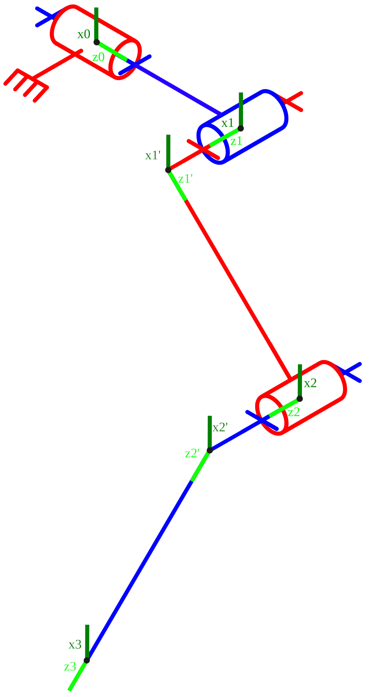

# Modélisation géométrique : transformations homogènes

La modélisation géométrique permet de lier la position du bout de la patte et les angles des trois articulations.
Comme les moteurs du bras sont contrôlés en vitesse, ce modèle ne permettra pas de réaliser un premier contrôle mais permettra en revanche d'établir le modèle cinématique de la section suivante.

Le modèle géométrique direct (MGD) permet de définir la position de l'outil en fonction des angles des articulations et est établie grâce aux matrices de transformations homogènes.
Ces dernières sont définies d'après les repères de la ci-après eux-mêmes définis suivant la convention de Denavit-Hartenberg.

  

    
  

  

    Définition des repères du bras d'après la convention de Denavit-Hartenberg. Pour chaque repère, l'axe Y doit être placé de façon à former un trièdre direct avec les axes X et Z.
  

D'après cette convention, on peut construire la table suivante qui représente la configuration du robot.

| $i \rightarrow i+1$ | $\theta_{z_i}$ | $a_{x_{i+1}}$ | $d_{z_i}$ | $\alpha_{x_{i+1}}$ |
| ----- | ----- | ----- | ----- | ----- |
| $0 \rightarrow 1$   | $\theta_1$     | $0$           | $h_1$     | $-90$              |
| $1 \rightarrow 1'$  | $\theta_2$     | $0$           | $h_2$     | $90$               |
| $1' \rightarrow 2$  | $0$            | $0$           | $l_2$     | $-90$              |
| $2 \rightarrow 2'$  | $\theta_3$     | $0$           | $h_3$     | $90$               |
| $2' \rightarrow 3$  | $0$            | $0$           | $l_3$     | $0$                |

Table des configurations du robot avec les paramètres DH

En considérant la formule de matrice de transformation homogène suivante :
$$
	^iT_{i+1} = \text{rot}_{z_{\theta_{i+1}}} \cdot \text{Trans}_{x_{i+1} 0, d_{z_i}} \cdot \text{rot}_{x_{\alpha{i+1}}},
$$

et en se basant sur la définition de \textcite{siciliano2009robotics}

$$
	{^iT_i(\theta_i)} =
	\begin{bmatrix}
		C\theta_i & -S\theta_iC\alpha_i & S\theta_iS\alpha_i  & a_iC\theta_i \\
		S\theta_i & C\theta_iC\alpha_i  & -C\theta_iS\alpha_i & a_iS\theta_i \\
		0         & S\alpha_i           & C\alpha_i           & d_i          \\
		0         & 0                   & 0                   & 1
	\end{bmatrix},
$$

on peut construire les cinq matrices de transformations homogènes suivante :

$$
	{^1T_0}(\theta_1)      =
	\begin{bmatrix}
		C\theta_1 & 0  & -S\theta_1 & 0   \\
		S\theta_1 & 0  & C\theta_1  & 0   \\
		0         & -1 & 0          & h_1 \\
		0         & 0  & 0          & 1
	\end{bmatrix} \\
$$
$$
	{^{1'}T_1}(\theta_2)   =
	\begin{bmatrix}
		C\theta_2 & 0 & S\theta_2  & 0   \\
		S\theta_2 & 0 & -C\theta_2 & 0   \\
		0         & 1 & 0          & h_2 \\
		0         & 0 & 0          & 1
	\end{bmatrix}   \\
$$
$$
	{^2T_{1'}} ()          =
	\begin{bmatrix}
		1 & 0  & 0 & 0   \\
		0 & 0  & 1 & 0   \\
		0 & -1 & 0 & l_2 \\
		0 & 0  & 0 & 1
	\end{bmatrix}                  \\
$$
$$
	{^{2'}T_2} (\theta_3)  =
	\begin{bmatrix}
		C\theta_3 & 0 & S\theta_3  & 0   \\
		S\theta_3 & 0 & -C\theta_3 & 0   \\
		0         & 1 & 0          & h_3 \\
		0         & 0 & 0          & 1
	\end{bmatrix}   \\
$$
$$
	{^3T_{2'}} ()          =
	\begin{bmatrix}
		1 & 0 & 0 & 0   \\
		0 & 1 & 0 & 0   \\
		0 & 0 & 1 & l_3 \\
		0 & 0 & 0 & 1
	\end{bmatrix}\notag
$$

Comme les deux matrices ${^2T_{1'}}$ et ${^3T_{2'}}$ sont constantes (i.e. ne dépendent pas de $\theta$), on peut les fusionner avec leurs deux matrices précédentes afin de ne se retrouver qu'avec les trois matrices suivantes :

$$
	{^1T_0}(\theta_1)   =
	\begin{bmatrix}
		C\theta_1 & 0  & -S\theta_1 & 0   \\
		S\theta_1 & 0  & C\theta_1  & 0   \\
		0         & -1 & 0          & h_1 \\
		0         & 0  & 0          & 1
	\end{bmatrix}
$$

$$
	{^2T_1}(\theta_2)   =
	\begin{bmatrix}
		C\theta_2 & -S\theta_2 & 0 & l_2*S\theta_2  \\
		S\theta_2 & C\theta_2  & 0 & -l_2*C\theta_2 \\
		0         & 0          & 1 & h_2            \\
		0         & 0          & 0 & 1
	\end{bmatrix}
$$

$$
	{^3T_2} (\theta_3)  =
	\begin{bmatrix}
		C\theta_3 & 0 & S\theta_3  & l_3*S\theta_3  \\
		S\theta_3 & 0 & -C\theta_3 & -l_3*C\theta_3 \\
		0         & 1 & 0          & h_3            \\
		0         & 0 & 0          & 1
	\end{bmatrix}
$$

Ainsi, en multipliant ces trois matrices, on trouve le MGD, fonction définie par les trois premières lignes de la dernière colonne de la matrice $^3T_0$. Ainsi, cette fonction est
$$
	\begin{bmatrix}
		x \\
		y \\
		z
	\end{bmatrix}
	=
	\begin{pmatrix}
		f_1(\theta_1) \\
		f_2(\theta_2) \\
		f_3(\theta_3)
	\end{pmatrix}
	=
	\begin{bmatrix}
		C\theta_1*(l_3*S(\theta_2 + \theta_3) + l_2*S\theta_2) - S\theta_1*(h_2 + h_3) \\
		C\theta_1*(h_2 + h_3) + S\theta_1*(l_3*S(\theta_2 + \theta_3) + l_2*S\theta_2) \\
		h_1 + l_3*C(\theta_2 + \theta_3) + l_2*C\theta_2
	\end{bmatrix}
$$

# Modélisation cinématique

\begin{itemize}
    \item utilisation de la modélisation cinématique
    \item pourquoi mieux que géométrique dans ce contexte
\end{itemize}

## Direct : dérivée du MGD

\begin{itemize}
    \item méthode, explication
\end{itemize}

Le modèle cinématique direct (MCD), qui relie la vitesse des coordonnées opérationnelles en fonction des vitesses articulaires, est noté
$$
	\boldsymbol{\dot{X}} = \boldsymbol{J}(\boldsymbol q)\boldsymbol{\dot{q}}
$$

\noindent où $J(\boldsymbol q)$ désigne la matrice jacobienne de dimension (3x3) du robot, est égale à $\cfrac{\partial \boldsymbol{X}}{\partial \boldsymbol{q}}$ et est fonction de la configuration articulaire \textbf{q}.

### Jacobienne

La jacobienne est définie comme la matrice des dérivées partielles du modèle géométrique direct.
Cette méthode fonctionne bien ici car on est en possession d'un robot avec peu de degrés de libertés.
En repartant de l'\citeref{eq:mgd}, on peut définir trois fonctions $f_i(\boldsymbol q)$ telles que

$$
	MGD(\boldsymbol q) =
	\begin{bmatrix}
		f_1(\boldsymbol q) \\
		f_2(\boldsymbol q) \\
		f_3(\boldsymbol q)
	\end{bmatrix}
$$

De cette manière, on peut écrire que

$$
	\boldsymbol{J}(\boldsymbol q) =
	\begin{bmatrix}
		\cfrac{\partial f_1}{\partial q_1}(\boldsymbol q) & \cfrac{\partial f_1}{\partial q_2}(\boldsymbol q) & \cfrac{\partial f_1}{\partial q_3}(\boldsymbol q) \\
		\cfrac{\partial f_2}{\partial q_1}(\boldsymbol q) & \cfrac{\partial f_2}{\partial q_2}(\boldsymbol q) & \cfrac{\partial f_2}{\partial q_3}(\boldsymbol q) \\
		\cfrac{\partial f_3}{\partial q_1}(\boldsymbol q) & \cfrac{\partial f_3}{\partial q_2}(\boldsymbol q) & \cfrac{\partial f_3}{\partial q_3}(\boldsymbol q)
	\end{bmatrix}
$$

Ainsi, les termes de la jacobienne sont
$$
	\cfrac{\partial f_1}{\partial q_1}(\boldsymbol q) = -S q_1(l3S( q_2+ q_3)) + l_2S q_2) - (h_2 + h_3)C q_1 \\
	\cfrac{\partial f_1}{\partial q_2}(\boldsymbol q) = -(h_2 + h_3)S q_1 + C q_1(l_3S( q_2+ q_3)+l_2S q_2)   \\
	\cfrac{\partial f_1}{\partial q_3}(\boldsymbol q) = 0                                                     \\
	\cfrac{\partial f_2}{\partial q_1}(\boldsymbol q) =  C q_1(l_3C( q_2+ q_3) + l_2C q_2)                    \\
	\cfrac{\partial f_2}{\partial q_2}(\boldsymbol q) = S q_1(l_3C( q_2+ q_3) + l_2C q_2)                     \\
	\cfrac{\partial f_2}{\partial q_3}(\boldsymbol q) = -S( q_2+ q_3)l_2S q_2                                 \\
	\cfrac{\partial f_3}{\partial q_1}(\boldsymbol q) =  l_3C q_1C( q_2+ q_3)                                 \\
	\cfrac{\partial f_3}{\partial q_2}(\boldsymbol q) = l3S q_1C( q_2+ q_3)                                   \\
	\cfrac{\partial f_3}{\partial q_3}(\boldsymbol q) = -S( q_2+ q_3)
$$

## Indirect : pseudo-inverse Jacobienne

\begin{itemize}
    \item méthode, explication
\end{itemize}

Le modèle cinématique inverse (MCI), qui permet de relier les vitesses articulaires aux coordonnées opérationnelles de l'outil, est noté
$$
	\dot{\boldsymbol q} = \boldsymbol{J}^{-1}(\boldsymbol q)\dot{\boldsymbol X}
$$

# Modélisation dynamique

\begin{itemize}
    \item utilisation de la modélisation dynamique
    \item pourquoi mieux que cinématique dans ce contexte
\end{itemize}

## Direct : formulation de Lagrange

\begin{itemize}
    \item méthode, explication
\end{itemize}

## Indirect : ???

\begin{itemize}
    \item méthhode, explication
\end{itemize}

## vérification

\begin{itemize}
    \item pnicchio et urdf
\end{itemize}

# Modélisation du BLDC (à garder?)

\begin{itemize}
    \item elec et meca
    \item définir variables
\end{itemize}

## ???
